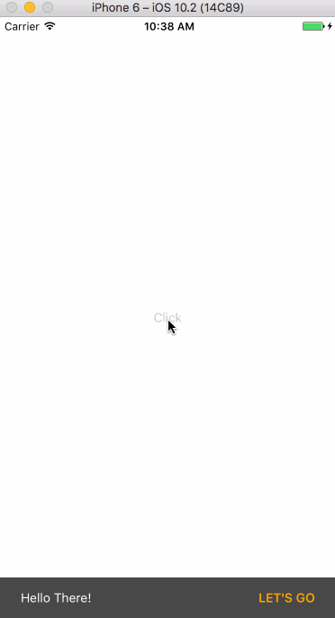

# react-native-snack-bar

A snackBar component for React Native



## Note
This repo is forked by [SiDevesh](https://github.com/SiDevesh/React-Native-SnackBar-Component), The function is the same, I refactor it with ES6 synax and 
eslint which looks make more sense. Also with example code attached in the repo.

## Getting started
```bash
npm install react-native-snack-bar --save
```
